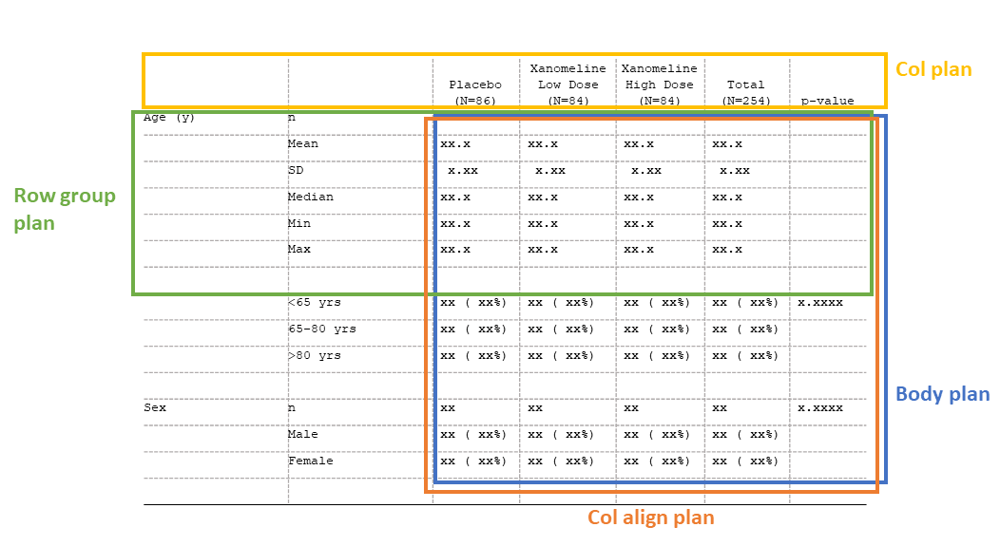

```{r, include = FALSE}
knitr::opts_chunk$set(
  collapse = TRUE,
  comment = "#>"
)
```

```{r setup, echo=FALSE}
library(tlang)
```

# tlang
<!-- badges: start -->
[](https://github.com/GSK-Biostatistics/tlang/actions)
[](https://app.codecov.io/gh/GSK-Biostatistics/tlang?branch=main)
<!-- badges: end -->

The tlang package provides a language for defining display-related metadata, which can then be used to automate and easily update output formats. 

In clinical trials, displays are generally quite standard, but frequent, highly specific formatting tweaks (e.g., rounding, footnotes, headers) are very common. Prior to data analysis, study teams often generate mock displays to represent the desired end product for sponsors to approve or programmers to replicate. This process is typically highly manual and separate from the programming itself. There is also a high importance placed on verifying the accuracy of the results via a QC process such as double programming. Finally, there is a movement toward an industry standard data structure for Analysis Results Data "ARD", which means analysis results datasets will have consistent structures and column names.

tlang supports a vision where:

  - Mock displays are integrated with the programming workflow
  - Results are QC'ed prior to formatting
  - Standard formatting styles can be applied in as little as one line of code
  - The ARD structure can be leveraged to accommodate a variety of tables

By reducing the amount of repetitive tasks, study teams can focus on the quality and interpretation of the results themselves. 

# Why tlang? 

While there are many existing table-making packages in the R ecosystem, they typically fall into one of two categories:

  - Table packages that perform analyses and format the results
  - Table packages that format and output existing data
  
By design, tlang is more of the latter, as it is intended to be used after the results have been computed. What makes tlang unique, however, is that it offers an intuitive interface for defining and layering standard (or non-standard!) formats that are often specific to clinical trials. It also offers the novel ability to easily generate mock displays using metadata that will be used for the actual displays. tlang is built on top of the powerful gt package, which is intended to support a variety of output formats in the future. 
  
# Installation

The development version of tlang can be installed with:
```{r eval =FALSE}
devtools::install_github("GSK-Biostatistics/tlang")
```

# Functionality

Here is an overview of what is possible with tlang:

- Create a "tfrmt" metadata object containing all formatting and labeling for the display
- Layer tfrmt objects to combine standard formatting with user-specific formatting
- Create mock displays based on existing sample data or no prior data 
- ARD-standard compliant facilitates reuse and automation

Other benefits of tlang:

- Provides a tidyverse-friendly, pipeable interface
- Leverages gt as output engine, which allows for further customizations within gt itself


# Input data structure

We expect an input dataset that is long, with 1 record per computed value. Required columns include:

- [Optional] 1 or more **group** columns, containing grouping values 
- A single **label** column, containing row label values
- 1 or more **column** columns, containing column values 
- A single **param** column, which provides a label for distinct types of values
- A single **values** column, containing the computed, raw data values
- [Optional] 1 or more **sorting_cols** columns, containing numeric vlaues to be used in the row ordering


# Building blocks

**1. Table format:** `tfrmt()`

The table format ("tfrmt") object is the most fundamental building block in tlang. tfrmt is a way to predefine the non-data components of your tables and how the data will be handled once added. tfrmt allows you to specify cell formats and labeling such as column headers, footnotes, etc. In addition, tfrmts can be layered. 

**2. Plans:** `*_plan()`

Much of the tfrmt is divided into "plans" which provide the blueprint for how the table will look. These plans are as follows:

- Body plan (`body_plan`): define how cells will be formatted
- Column plan (`col_plan`): define column and spanning headers, order columns, and drop unnecessary columns
- Row group plan (`row_grp_plan`): define labeling for groups of rows and add styling to groups of rows
 
<p align="center"></p>

**3. Structures:** `*_structure()`

Within a plan, one or more structures may be provided. Each structure specifies the layers within a plan. For example, in the body plan, each "frmt_structure" object defines how a set of values (e.g., all "p-values") should be formatted. Structures are inherently row-oriented, and can range from broad (e.g., apply to all relevant rows in the data) to specific (e.g., apply to all relevant rows within a specific grouping value).

In the figure below, each color represents a different format structure (`frmt_structure`) to be passed in the table body plan (`body_plan`).

<p align="center"></p>

The following structures are available:

- Format structure (`frmt_structure`) inside of body plan (`body_plan`)
- Column label spanning structure (`span_structure`) inside of column plan (`col_plan`)
- Row group structure (`row_grp_structure`) inside of row group plan (`row_grp_plan`)


**4. Elements:** `element_*()`

Inspired by ggplot2, elements are a way to apply styling that is purely aesthetic in nature, such as how a column should be aligned (`element_align`). These are passed through plan or structure objects. 

# Putting it all together

Let's look at the CDISC pilot demographics table as an example. Suppose we've derived our analysis results data in the required format:
```{r echo = FALSE, warning = FALSE, message = FALSE}
source("dev/data/tbl_demog_data.R")
demog_dat <- create_tbl_demog_data() %>% 
  select(rowlbl1, rowlbl2, column, param, value, ord1, ord2) %>% 
  ungroup
```

```{r echo = TRUE}
print(demog_dat, n=40)
```

We can prepare the `tfrmt` for our data and apply it as follows:

```{r echo = TRUE, eval = FALSE}
tfrmt <- tfrmt(
  
  # specify columns in the data
  group = rowlbl1,
  label = rowlbl2,
  column = column, 
  param = param,
  values = value,
  sorting_cols = c(ord1, ord2),
  
  # Specify body plan
  body_style = table_body_plan(
    frmt_structure(group_val = ".default", label_val = ".default", frmt_combine("{n} {pct}", 
                                                                                n = frmt("XXX"),
                                                                                pct = frmt_when("==100" ~ "",
                                                                                                "==0" ~ "",
                                                                                                TRUE ~ frmt("(XX.X %)")))),
    frmt_structure(group_val = ".default", label_val = "n", frmt("xxx")),
    frmt_structure(group_val = ".default", label_val = c("Mean", "Median", "Min","Max"), frmt("xxx.x")),
    frmt_structure(group_val = ".default", label_val = "SD", frmt("xxx.xx")),
    frmt_structure(group_val = ".default", label_val = ".default", p = frmt_when(">0.99" ~ ">0.99",
                                                                                 "<0.001" ~ "<0.001",
                                                                                 TRUE ~ frmt("x.xxx", missing = "")))
  ),
  
  # Specify row group plan
  row_grp_style = row_grp_plan(
    row_grp_structure(group_val = ".default", element_block(post_space = " ")),
    label_loc = element_row_grp_loc(label = "indented")
  ),
  
  # Specify column alignment plan
  col_align = col_align_plan(
    element_align(align = c(".",","," "), col = vars(everything()))
  ),
  
  # remove extra cols
  col_select = vars(-starts_with("ord"))
) 

print_to_gt(tfrmt, demog_dat)
```


