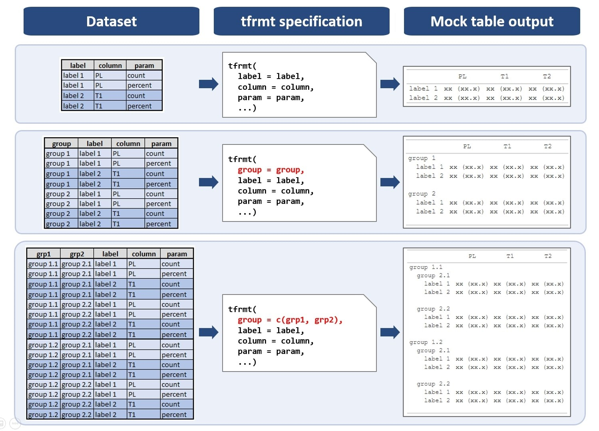

# Row Group Plan

``` r
library(tfrmt)
```

Performing many calculations within a group is easier than ever due to
tools in the tidyverse. tfrmt’s expectation of a standard, long data
format is not only in alignment with tidy data principles and workflows,
but it allows for the user to easily specify group-wise aesthetic
formatting. tfrmt also allows the user to display row labels in a
variety of ways.

## Row group structure

Like the `body_plan`, tfrmt’s row group plan (`row_grp_plan`), allows
the user to specify any number of row group structure
(`row_grp_structure`) objects, which define how groups of rows should
appear.

The `row_grp_structure` contains `group_val` argument to define the
relevant group values; this behaves like a filter to the relevant
values. From there, the `row_grp_structure` essentially performs a
group_by to apply the formatting within each unique combination of group
values.

### Element block objects

As the `row_grp_structure`s are purely aesthetic in nature, they accept
`element_block` objects which define the styling of a given group of
rows. `element_block` objects are a work in progress, but they currently
provide the ability to add empty rows or lines following groups of data.

To add a post space after all groups of values based on the variable
“grp1” (our group in the `tfrmt` object) we do the following:

`row_grp_structure(group_val = ".default", element_block(post_space = " "))`

``` r
my_tfrmt <- tfrmt(
  group = grp1,
  label = label,
  param = param,
  value = value,
  column = column,
  row_grp_plan = row_grp_plan(
    row_grp_structure(group_val = ".default", element_block(post_space = "   "))
  ),
  body_plan = body_plan(
    frmt_structure(group_val = ".default", label_val = ".default", frmt("xx"))
  )
)

print_mock_gt(my_tfrmt, .default = 1:2) |>
  gt::tab_style(
    style = gt::cell_text(whitespace = "pre", align = "left"),
    locations = gt::cells_stub()
  )
```

[TABLE]

To add a post space after values where grp1 = “grp1_1” only we do the
following:

``` r
my_tfrmt <- tfrmt(
  group = grp1,
  label = label,
  param = param,
  value = value,
  column = column,
  row_grp_plan = row_grp_plan(
    row_grp_structure(group_val = "grp1_1", element_block(post_space = "   "))
  ),
  body_plan = body_plan(
    frmt_structure(group_val = ".default", label_val = ".default", frmt("xx"))
  )
)

print_mock_gt(my_tfrmt, .default = 1:2) |>
  gt::tab_style(
    style = gt::cell_text(whitespace = "pre", align = "left"),
    locations = gt::cells_stub()
  )
```

[TABLE]

As `group_val = "grp1_1"` in this table rather than
`group_val = "default"` previously, the post space after grp1_2 is
removed.

## Row labels

The gt package offers default displays for group and row labels which do
not cover all use cases, particularly if the user provides more than one
group variable. As such, tfrmt offers multiple objects for display.
Let’s see how they differ for the following options:

- **indented:** Combined group/label variables
- **spanning:** Top-level group label as row spanning header, remaining
  group/label columns indented
- **column:** All group/label columns in separate column
- **noprint:** Drop group labels

### indented

tfrmt will combine group and label variables into a single column, using
indentation to distinguish the hierarchies:

``` r
my_tfrmt <- tfrmt(
  group = c(grp1, grp2),
  label = label,
  param = param,
  value = value,
  column = column,
  row_grp_plan = row_grp_plan(
    label_loc = element_row_grp_loc(location = "indented")
  ),
  body_plan = body_plan(
    frmt_structure(group_val = ".default", label_val = ".default", frmt("xx"))
  )
)

print_mock_gt(my_tfrmt, .default = 1:2) |>
  gt::tab_style(
    style = gt::cell_text(whitespace = "pre", align = "left"),
    locations = gt::cells_stub()
  )
```

[TABLE]

### spanning

This is the default option from gt: group labels become spanning headers
over the rows. Note that in the case of multiple group variables, only
the top level group variable will be in the spanning row header, and the
rest will combine with the label variable using indentation:

``` r
my_tfrmt <- tfrmt(
  group = c(grp1, grp2),
  label = label,
  param = param,
  value = value,
  column = column,
  row_grp_plan = row_grp_plan(
    label_loc = element_row_grp_loc(location = "spanning")
  ),
  body_plan = body_plan(
    frmt_structure(group_val = ".default", label_val = ".default", frmt("xx"))
  )
)

print_mock_gt(my_tfrmt, .default = 1:2) |>
  gt::tab_style(
    style = gt::cell_text(whitespace = "pre", align = "left"),
    locations = gt::cells_stub()
  )
```

[TABLE]

### column

In this case, group labels become a separate column to the left. Note
that in the case of multiple group variables, only the top level group
variable will be in the column, and the rest will combine with the label
variable using indentation:

``` r
my_tfrmt <- tfrmt(
  group = c(grp1, grp2),
  label = label,
  param = param,
  value = value,
  column = column,
  row_grp_plan = row_grp_plan(
    label_loc = element_row_grp_loc(location = "column")
  ),
  body_plan = body_plan(
    frmt_structure(group_val = ".default", label_val = ".default", frmt("xx"))
  )
)

print_mock_gt(my_tfrmt, .default = 1:2) |>
  gt::tab_style(
    style = gt::cell_text(v_align = "top"),
    locations = gt::cells_stub(columns = c(1:3))
  )
```

|        |        |         | column1 | column2 | column3 |
|:-------|--------|---------|---------|---------|---------|
| grp1_1 | grp2_1 | label_1 | xx      | xx      | xx      |
|        |        | label_2 | xx      | xx      | xx      |
|        | grp2_2 | label_1 | xx      | xx      | xx      |
|        |        | label_2 | xx      | xx      | xx      |
| grp1_2 | grp2_1 | label_1 | xx      | xx      | xx      |
|        |        | label_2 | xx      | xx      | xx      |
|        | grp2_2 | label_1 | xx      | xx      | xx      |
|        |        | label_2 | xx      | xx      | xx      |

### noprint

A user may also suppress the printing of any group variable by
specifying the “noprint” option.

``` r
my_tfrmt <- tfrmt(
  group = c(grp1, grp2),
  label = label,
  param = param,
  value = value,
  column = column,
  row_grp_plan = row_grp_plan(
    label_loc = element_row_grp_loc(location = "noprint")
  ),
  body_plan = body_plan(
    frmt_structure(group_val = ".default", label_val = ".default", frmt("xx"))
  )
)

print_mock_gt(my_tfrmt, .default = 1:2)
```

|         | column1 | column2 | column3 |
|:--------|---------|---------|---------|
| label_1 | xx      | xx      | xx      |
| label_2 | xx      | xx      | xx      |
| label_1 | xx      | xx      | xx      |
| label_2 | xx      | xx      | xx      |
| label_1 | xx      | xx      | xx      |
| label_2 | xx      | xx      | xx      |
| label_1 | xx      | xx      | xx      |
| label_2 | xx      | xx      | xx      |

### Help images




