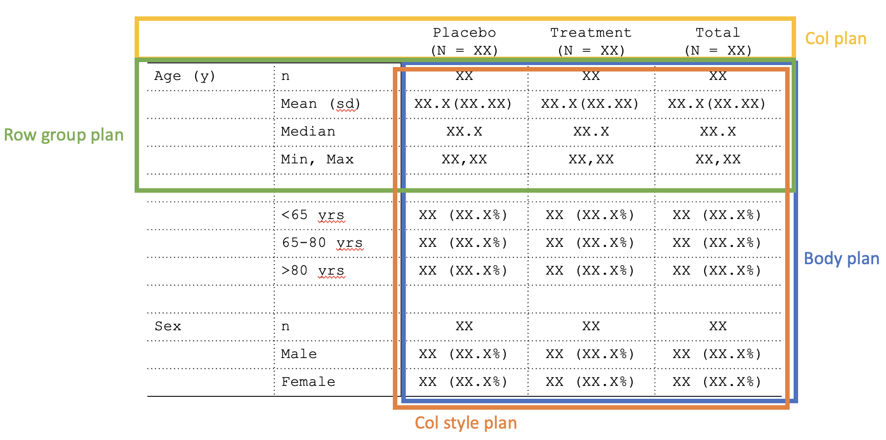
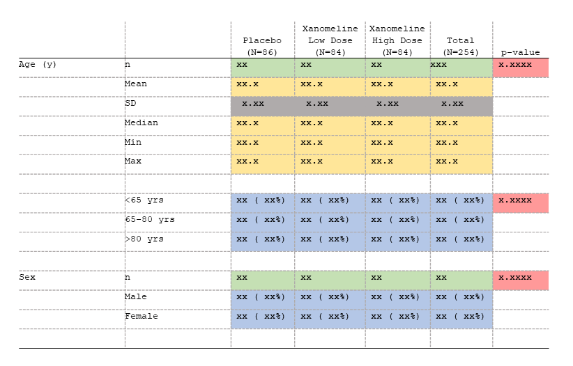

```{r, include = FALSE}
knitr::opts_chunk$set(
  collapse = TRUE,
  comment = "#>"
)
```

```{r setup, echo=FALSE}
library(tlang)
```

**1. Table format:** `tfrmt()`

The table format ("tfrmt") object is the most fundamental building block in tlang. tfrmt is a way to predefine the non-data components of your tables and how the data will be handled once added. tfrmt allows you to specify cell formats and labeling such as column headers, footnotes, etc. In addition, tfrmts can be layered. 

**2. Plans:** `*_plan()`

Much of the tfrmt is divided into "plans" which provide the blueprint for how the table will look. These plans are as follows:

- Body plan (`body_plan`): define how cells will be formatted
- Column plan (`col_plan`): define column and spanning headers, order columns, and drop unnecessary columns
- Row group plan (`row_grp_plan`): define labeling for groups of rows and add styling to groups of rows
- Column alignment plan (`col_align_plan`): define how column values will be aligned 
 
<p align="center"></p>

**3. Structures:** `*_structure()`

The structure objects are for defining how the *contents* of the table (i.e., text) should be displayed. Within a plan, one or more structures may be provided. Each structure specifies the layers within a plan. For example, in the body plan, each "frmt_structure" object defines how a set of values (e.g., all "p-values") should be formatted. Structures are inherently row-oriented, and can range from broad (e.g., apply to all relevant rows in the data) to specific (e.g., apply to all relevant rows within a specific grouping value).

In the figure below, each color represents a different format structure (`frmt_structure`) to be passed in the table body plan (`body_plan`).

<p align="center"></p>

The following structures are available:

- Format structure (`frmt_structure`) inside of body plan (`body_plan`)
- Column label spanning structure (`span_structure`) inside of column plan (`col_plan`)
- Row group structure (`row_grp_structure`) inside of row group plan (`row_grp_plan`)


**4. Elements:** `element_*()`

The element objects are for defining the *aesthetics* of the table (i.e., non-text styling). Inspired by ggplot2, elements provide a mechanism for performing aesthetic modifications such as column alignment (`element_align`) or the positioning of group labels (`element_row_grp_loc`). These are passed through plan or structure objects. 

