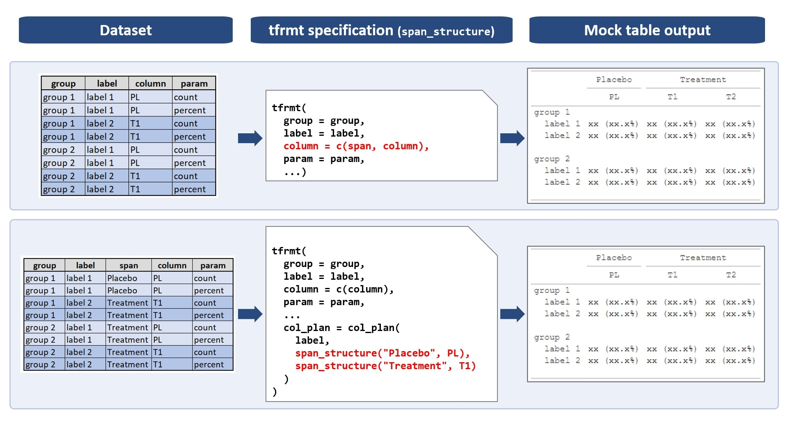

```{r, include = FALSE}
knitr::opts_chunk$set(
  collapse = TRUE,
  comment = "#>"
)
```

```{r setup, message = FALSE, warning = FALSE}
library(tfrmt)
library(tibble)
library(dplyr)
```

The purpose of the column plan (`col_plan`) is to allow the user to specify how columns in the final table should appear in regards to their labelled and ordering. Similar to the column styling plan (`col_style_plan`), `col_plan` refers to the final columns of the table, i.e., the values found in the `column` variable(s) from the input dataset. The `col_plan` is like a glorified version of dplyr's `select` function; just like `select`, the user can add, drop, order, and/or rename columns all in one step. What sets the `col_plan` apart, however, is the ability to also specify column spanners and labels in a hierarchical fashion.

The specification and behaviour of the `col_plan` is dependent on the number of column variables that are provided to the tfrmt:

| col_plan options:          | 1 column variable | >1 column variable                |
| -------------------------- | ----------------- | --------------------------------- |
| **Rename columns**         | Yes               | Yes                               |
| **Reorder columns**        | Yes               | Yes                               |
| **Rename spanning labels** | NA                | Yes                               |

As shown in the table, the `col_plan` is most powerful in conjunction with the use of multiple `column` variables. In many cases, such as when a user performs the analysis by treatment group, these "by" variables can essentially be re-purposed as data-driven spanners in the form of upper level `column` variables. 

Let's look at each of these key workflows in more detail.

# Option 1: A single `column` variable 

Let's consider the following dataset which includes a single `column` variable:

```{r}
dat <- tribble(
    ~group,     ~label,  ~my_col,    ~parm, ~val,
    "g1", "rowlabel1",  "col1"  ,  "value",    1,
    "g1", "rowlabel1",  "col2"  ,  "value",    1,
    "g1", "rowlabel1",  "mycol3",  "value",    1,
    "g1", "rowlabel1",  "col4"  ,  "value",    1,
    "g1", "rowlabel1",  "mycol5",  "value",    1,
    "g1", "rowlabel2",  "col1"  ,  "value",    2,
    "g1", "rowlabel2",  "col2"  ,  "value",    2,
    "g1", "rowlabel2",  "mycol3",  "value",    2,
    "g1", "rowlabel2",  "col4"  ,  "value",    2,
    "g1", "rowlabel2",  "mycol5",  "value",    2,
    "g2", "rowlabel3",  "col1"  ,  "value",    3,
    "g2", "rowlabel3",  "col2"  ,  "value",    3,
    "g2", "rowlabel3",  "mycol3",  "value",    3,
    "g2", "rowlabel3",  "col4"  ,  "value",    3,
    "g2", "rowlabel3",  "mycol5",  "value",    3)
  
```


## Simple Column Selection

In the case of a single column variable with no column spanners, `col_plan` behaves similarly to `dplyr::select`. 

Let's say we want to remove one of the columns:
```{r}
tfrmt(
    group = group,
    label = label,
    param = parm,
    values = val,
    column = my_col,
    body_plan = body_plan(
      frmt_structure(group_val = ".default", label_val = ".default", frmt("x"))
    ),
    col_plan = col_plan(
      -mycol5            
    )
  ) %>% 
  print_to_gt(dat)
```

Just like `dplyr::select`, we can also reorder, rename, and remove columns, using `tidyselect` syntax if we'd like:

```{r}
tfrmt(
    group = group,
    label = label,
    param = parm,
    values = val,
    column = my_col,
    body_plan = body_plan(
      frmt_structure(group_val = ".default", label_val = ".default", frmt("x"))
    ),
    col_plan = col_plan(
      group, 
      label, 
      starts_with("col"),
      new_col_3 = mycol3,  
      -mycol5            
    )
  ) %>% 
  print_to_gt(dat)
```

Unlike `dplyr::select` though, col_plan respects the _last_ time a column is defined in the plan. This allows for reordering/moving a column to the end very easily.

```{r}
tfrmt(
    group = group,
    label = label,
    param = parm,
    values = val,
    column = my_col,
    body_plan = body_plan(
      frmt_structure(group_val = ".default", label_val = ".default", frmt("x"))
    ),
    col_plan = col_plan(
      group, 
      label, 
      starts_with("col"),
      everything(),
      col1         
    )
  ) %>% 
  print_to_gt(dat)
```


# Editing and Moving Column Spanners

Multiple `column` variables are used to form the hierarchy of column spanners and column labels, which is driven by the order of the `column` variables. The first variable specified represents the highest level spanner, while the last variable specified represents the lowest level column label. Similar to the case of 1 `column` variable, the user may remove and rename values for the lowest level `column` variable within col_plan. To edit or move the columns based on the the column spanners, span_structure must be used.

Let's consider an example dataset with multiple `column` variables:

```{r}
dat <- tribble(
    ~group,     ~label,        ~span2,  ~span1,     ~my_col,    ~parm,   ~val,
    "g1", "rowlabel1",  "column cols", "cols 1,2", "col1"  ,  "value",    1,
    "g1", "rowlabel1",  "column cols", "cols 1,2", "col2"  ,  "value",    1,
    "g1", "rowlabel1",             NA,         NA, "mycol3",  "value",    1,
    "g1", "rowlabel1",  "column cols", "col 4"   , "col4"  ,  "value",    1,
    "g1", "rowlabel1",             NA,         NA, "mycol5",  "value",    1,
    "g1", "rowlabel2",  "column cols", "cols 1,2", "col1"  ,  "value",    2,
    "g1", "rowlabel2",  "column cols", "cols 1,2", "col2"  ,  "value",    2,
    "g1", "rowlabel2",             NA,        NA , "mycol3",  "value",    2,
    "g1", "rowlabel2",  "column cols", "col 4"   , "col4"  ,  "value",    2,
    "g1", "rowlabel2",             NA,         NA, "mycol5",  "value",    2,
    "g2", "rowlabel3",  "column cols", "cols 1,2", "col1"  ,  "value",    3,
    "g2", "rowlabel3",  "column cols", "cols 1,2", "col2"  ,  "value",    3,
    "g2", "rowlabel3",             NA,         NA, "mycol3",  "value",    3,
    "g2", "rowlabel3",  "column cols", "col 4"   , "col4"  ,  "value",    3,
    "g2", "rowlabel3",             NA,         NA, "mycol5",  "value",    3,
  )
```

Notice that our `col_plan` is considerably simpler and our higher level columns are repurposed as column spanners:

```{r}
tfrmt(
    group = group,
    label = label,
    param = parm,
    values = val,
    column = c(span2, span1, my_col),
    body_plan = body_plan(
      frmt_structure(group_val = ".default", label_val = ".default", frmt("x"))
    ),
    col_plan = col_plan(
      group, 
      label, 
      starts_with("col"),
      new_col_3 = mycol3,  
      -mycol5            
    )
  ) %>% 
  print_to_gt(dat)
```

When there are multiple `column` variables provided, these are essentially combined together behind the scenes. This means that the column order can be defined by any of the `column` variables, including those representing the spanning. Specifically, we may order columns by leveraging `contains()` to reference any portion of those names.

Reordering with multiple `column` variables is simplest when the lowest level column variable contains unique values (i.e., there is 1 value per column in the final table), like in the example above. Let's suppose we want to move the "col 4" column to the beginning and also reorder "col1" and "col2". To achieve this, we can select "col 4" and then "col2" and finally all the other columns. 

```{r}
tfrmt(
    group = group,
    label = label,
    param = parm,
    values = val,
    column = c(span2, span1, my_col),
    body_plan = body_plan(
      frmt_structure(group_val = ".default", label_val = ".default", frmt("x"))
    ),
    col_plan = col_plan(
      group, 
      label, 
      span_structure(span1 = c("col 4")),
      contains("col2"),
      everything(),
      new_col_3 = mycol3,  
      -mycol5            
    )
  ) %>% 
  print_to_gt(dat)
```

In many cases, we may not have uniqueness in the lower level column name. Take the following example:

```{r}
dat <- tribble(
    ~group,     ~label,     ~span ,  ~my_col,    ~parm,   ~val,
    "g1", "rowlabel1",  "Treament", "mean"   ,  "mean",    1.234,
    "g1", "rowlabel1",  "Treament", "sd"     ,  "sd"  ,    2.123,
    "g1", "rowlabel2",  "Placebo" , "mean"   ,  "mean",    2.843,
    "g1", "rowlabel2",  "Placebo" , "sd"     ,  "sd"  ,    1.435
  )
```

Notice that the columns `mean` and `sd` are repeated for each of the treatment groups, which are differentiated by the spanners (`span`). We are still able to modify the ordering, but we have lost a bit of control so we have to be careful of the order we put things into `col_plan`. When there are repeating names in the lowest level, it is best to start with the lowest level `column` variable values and move up the hierarchy, that ways if there are any contradictions, the latest will be used. For an example of this, see the Unusual Tables Vignette. 

# Summary

In summary, the use of 1 or >1 `column` variables is a personal choice. Depending on the chosen workflow, a user can achieve the desired column ordering and labelling through a combination of data preparation and `tfrmt` options.

## Help images

{width=100%}


