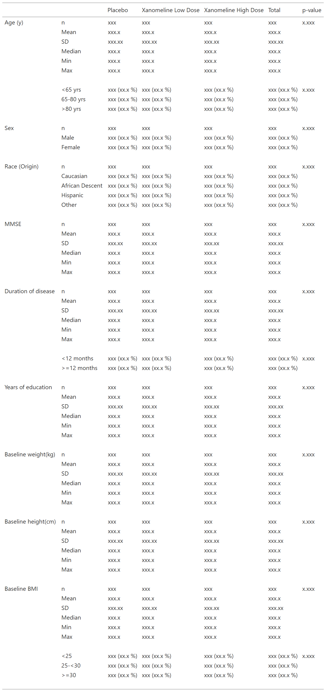

```{r, include = FALSE}
knitr::opts_chunk$set(
  collapse = TRUE,
  comment = "#>"
)
```

```{r setup}
library(tlang)
library(dplyr)
```

# Demography Table
For this demography table we are going to use `demog_data`, an example analysis results dataset found in the package, which is based on the CDISC pilot data. This dataset has two different row label columns, `rowlbl1` and `rowlbl2` because we are building a table with group and row labels. There are also two order columns which will be used to set the row order of the output. There is a single column to define our table's columns (multiple column columns are used when there is column spanning). Finally there is a param column, a value column and an additional grouping column, `grp`, which we can use for more complex formatting.

```{r, echo = FALSE}
head(demog_data)
```

The mock we are going to match looks like this:



For this table we have three dose columns, a total column and a p-value column as well as a mix of categorical and continuous analysis. 

The first thing we are going to do when building out the `tfrmt` is specify all our columns 
```{r}
tfrmt(
  # specify columns in the data
  group = vars(rowlbl1,grp),
  label = rowlbl2,
  column = column, 
  param = param,
  values = value,
  sorting_cols = vars(ord1, ord2)) %>% 
  print_to_gt(demog_data)
```

While this make a table it isn't a very nice table and defiantly doesn't match the mock. So lets start with formatting all the numbers. To do this we are going to build a `body_plan` to add to our `tfrmt`.  This will be a fairly quick explanation of `body_plan`s but if you like more information see `vignettes("Body Plan")` 

Body plans are made up of a series of `frmt_stucture`s where each `frmt_stucture` represents the formatting of a cell within the table. This will always be applies latest to oldest when applying formatting. This means the first `frmt_stucture` in the `body_plan` should be the most generic. You can use the groups, labels and parameters to specify which formatting applies to which values.  

To start with we are going to use all the rows that are "n (%)" as the default. This way we don't need to list out every row that is an "n (%)" row. These rows are made up of two different values, so we will need to use `frmt_combine`. Next, we can format the continuous variables, which is just a straight forward one value per row so we can just use the label to filter and `frmt` to define the look. Finally, we want format the p-values. This is a bit more complicated because although the group and label will match the other values it needs it own formatting. To so this we will need to specify the parameter in the `frmt_structure` like so `frmt_structure(group_val = ".default", label_val = ".default", p = frmt("x.xx")`. But, we also here we need to make sure it never reports 0 or 1. So we can use `frmt_when` to specify the formatting based on the value. 
```{r}
tfrmt(
  # specify columns in the data
  group = vars(rowlbl1,grp),
  label = rowlbl2,
  column = column, 
  param = param,
  values = value,
  sorting_cols = vars(ord1, ord2),
  # specify value formatting 
  body_plan = body_plan(
    frmt_structure(group_val = ".default", label_val = ".default", frmt_combine("{n} ({pct} %)", 
                                                                                n = frmt("xxx"),
                                                                                pct = frmt("xx.x"))),
    frmt_structure(group_val = ".default", label_val = "n", frmt("xxx")),
    frmt_structure(group_val = ".default", label_val = c("Mean", "Median", "Min","Max"), frmt("xxx.x")),
    frmt_structure(group_val = ".default", label_val = "SD", frmt("xxx.xx")),
    frmt_structure(group_val = ".default", label_val = ".default", p = frmt_when(">0.99" ~ ">0.99",
                                                                                 "<0.001" ~ "<0.001",
                                                                                 TRUE ~ frmt("x.xxx", missing = "")))
  )) %>% 
  print_to_gt(demog_data)
```
Now the numbers looks all correct, we can drop the order columns and the `grp` column. To do this we use a `col_plan` which uses `tidy-select` nomenclature to drop/move columns. 

```{r}
tfrmt(
  # specify columns in the data
  group = vars(rowlbl1,grp),
  label = rowlbl2,
  column = column, 
  param = param,
  values = value,
  sorting_cols = vars(ord1, ord2),
  # specify value formatting 
  body_plan = body_plan(
    frmt_structure(group_val = ".default", label_val = ".default", frmt_combine("{n} {pct}", 
                                                                                n = frmt("xxx"),
                                                                                pct = frmt_when("==100" ~ "",
                                                                                                "==0" ~ "",
                                                                                                TRUE ~ frmt("(xx.x %)")))),
    frmt_structure(group_val = ".default", label_val = "n", frmt("xxx")),
    frmt_structure(group_val = ".default", label_val = c("Mean", "Median", "Min","Max"), frmt("xxx.x")),
    frmt_structure(group_val = ".default", label_val = "SD", frmt("xxx.xx")),
    frmt_structure(group_val = ".default", label_val = ".default", p = frmt("")),
    frmt_structure(group_val = ".default", label_val = c("n","<65 yrs","<12 months","<25"), p = frmt_when(">0.99" ~ ">0.99",
                                                                                 "<0.001" ~ "<0.001",
                                                                                 TRUE ~ frmt("x.xxx", missing = "")))
  ),
  # remove extra cols
  col_plan = col_plan(-grp, 
                      -starts_with("ord") )) %>% 
  print_to_gt(demog_data)
```

Now this table looks just about right. There are two problems, (1) alignment and (2) spacing between the continuous and categorical values. To fit the alignment we are going to add a `col_algn_plan` which takes a series of `element_align`s. This was columns could be aligned differently if needed. This is a fairly straight forward and we want all the columns to algin on either ".", "," or " " so our `element_align` looks like `element_align(align = c(".",","," "), col = vars(everything()))`. 
After the alignment is sorted we can move on to the spacing. In order to match the spacing of the mock we need to use the extra `grp` column from our data. If we look at our data, we can see we want a space any time either of the groups change. 
```{r}
demog_data %>% 
  distinct(rowlbl1,grp)
```
This means that we can use a `row_grp_plan` with just a `".default"` as the group and it should handel all of the spacing. In addition to the spacing `row_grp_plan` will let us change the spanning group lables to an additional column by changing the `label_loc` to "column". 

```{r}
tfrmt(
  # specify columns in the data
  group = vars(rowlbl1,grp),
  label = rowlbl2,
  column = column, 
  param = param,
  values = value,
  sorting_cols = vars(ord1, ord2),
  # specify value formatting 
  body_plan = body_plan(
    frmt_structure(group_val = ".default", label_val = ".default", frmt_combine("{n} {pct}", 
                                                                                n = frmt("xxx"),
                                                                                pct = frmt_when("==100" ~ "",
                                                                                                "==0" ~ "",
                                                                                                TRUE ~ frmt("(xx.x %)")))),
    frmt_structure(group_val = ".default", label_val = "n", frmt("xxx")),
    frmt_structure(group_val = ".default", label_val = c("Mean", "Median", "Min","Max"), frmt("xxx.x")),
    frmt_structure(group_val = ".default", label_val = "SD", frmt("xxx.xx")),
    frmt_structure(group_val = ".default", label_val = ".default", p = frmt("")),
    frmt_structure(group_val = ".default", label_val = c("n","<65 yrs","<12 months","<25"), p = frmt_when(">0.99" ~ ">0.99",
                                                                                 "<0.001" ~ "<0.001",
                                                                                 TRUE ~ frmt("x.xxx", missing = "")))
  ),
  # remove extra cols
  col_plan = col_plan(-grp, 
                      -starts_with("ord") ),
  # Specify column alignment plan
  col_align = col_align_plan(
    element_align(align = c(".",","," "), col = vars(everything()))
  ),
  
    # Specify row group plan
  row_grp_plan = row_grp_plan(
    row_grp_structure(group_val = ".default", element_block(post_space = " ")),
    label_loc = element_row_grp_loc(location = "column")
  )
  
  ) %>% 
  print_to_gt(demog_data)
```


# AE tabel 


